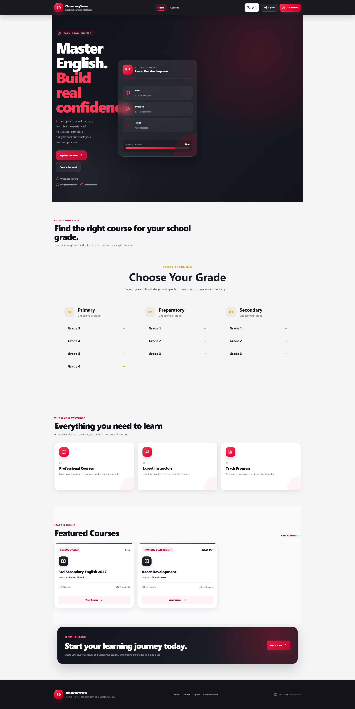
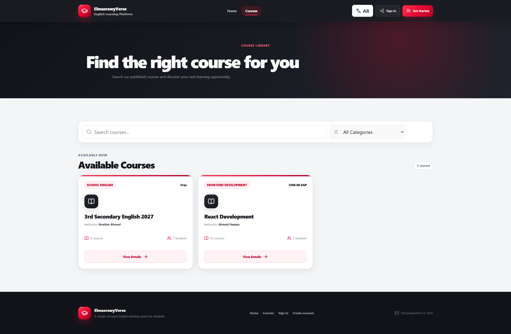
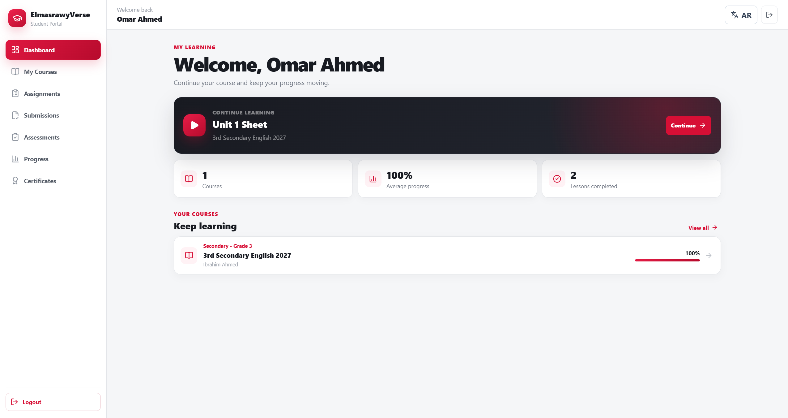
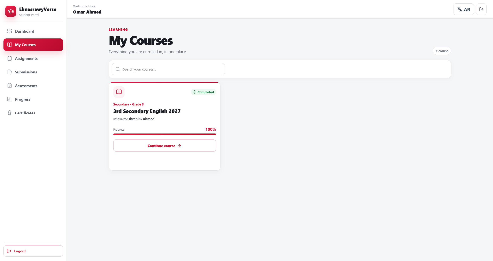
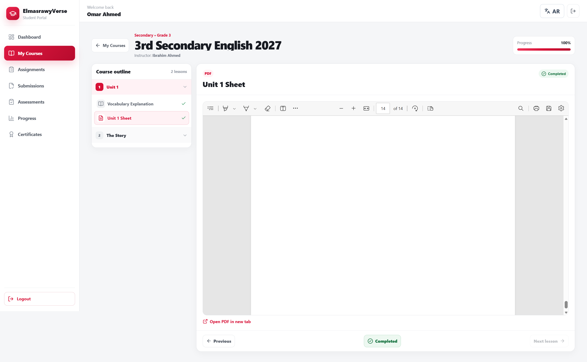
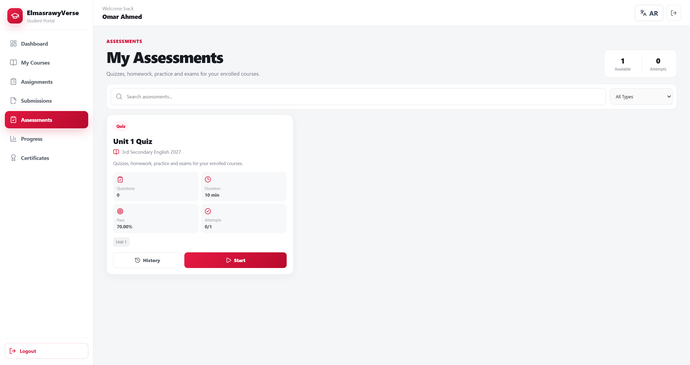
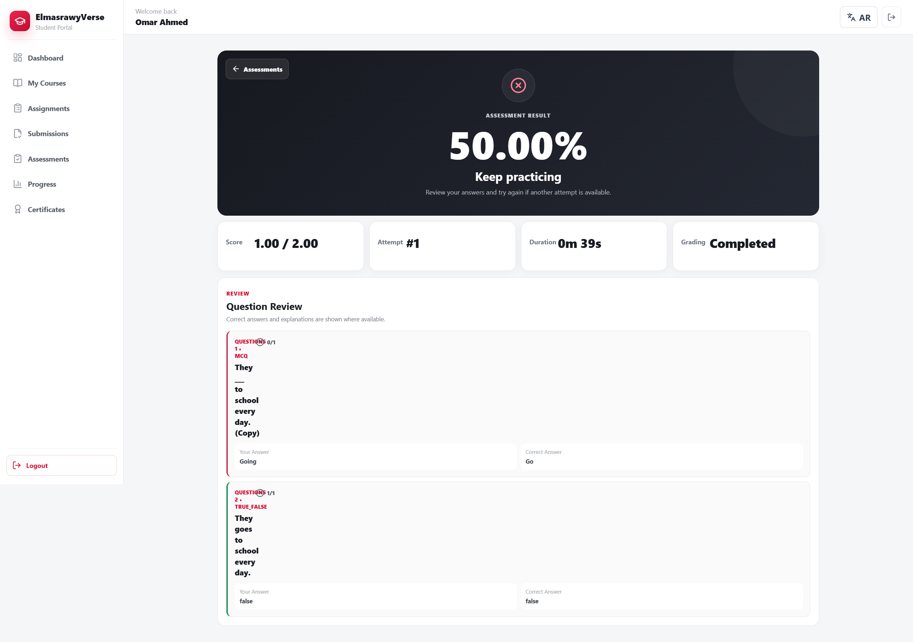
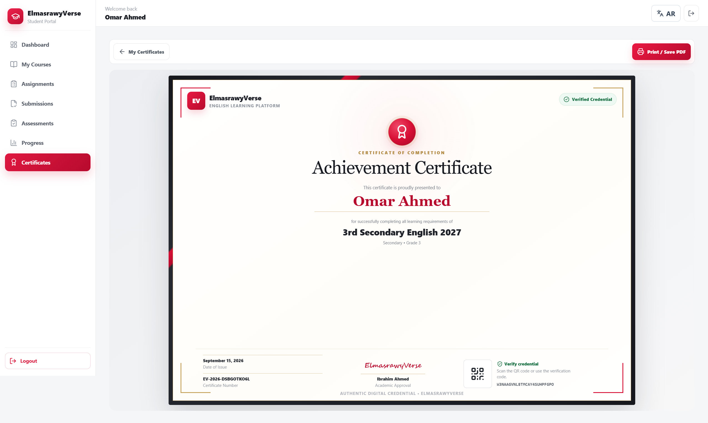
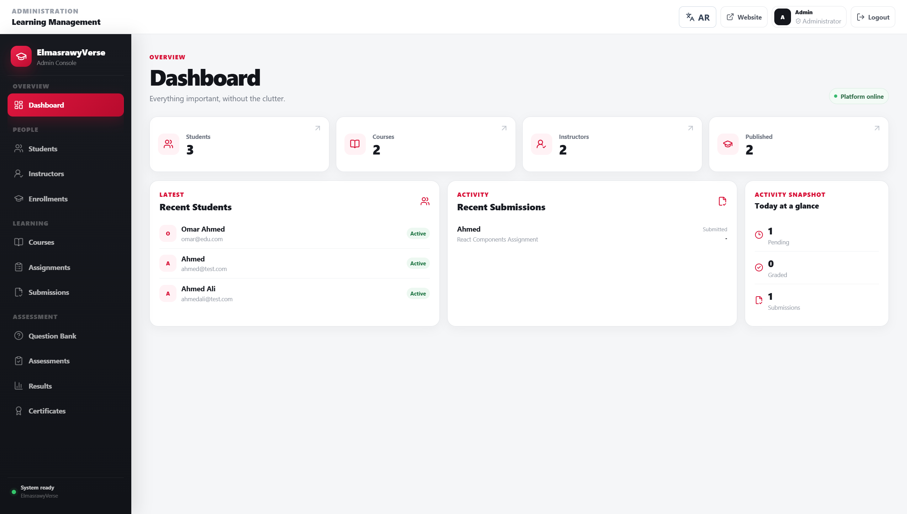
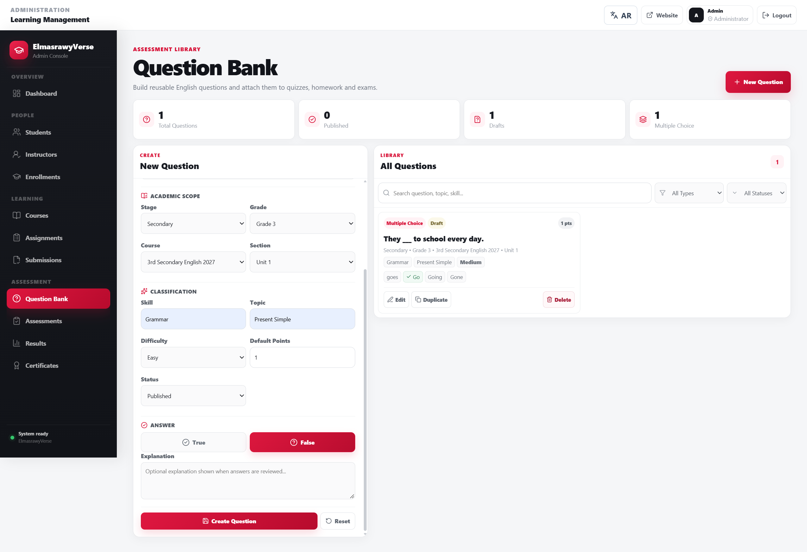

# ElmasrawyVerse — English Learning Platform

<p align="center">
  <strong>A full-stack English e-learning platform for students, instructors, and administrators.</strong>
</p>

<p align="center">
  Course delivery • Assessments • Assignments • Progress tracking • Certificates • Arabic / English
</p>

<p align="center">
  
  
  
  
  
</p>

---

## Overview

**ElmasrawyVerse** is a modern Learning Management System focused on English education.  
It provides a complete learning workflow from public course discovery and student registration to structured lessons, assignments, assessments, analytics, course completion, and verifiable certificates.

The platform includes separate experiences for:

- **Students** — learn, submit assignments, take assessments, track progress, and receive certificates.
- **Administrators** — manage students, instructors, enrollments, courses, content, question banks, assessments, grading, and certificates.
- **Public visitors** — browse courses, create an account, and verify certificates.

---

## Screenshots

### Home

<p align="center">
  
</p>

### Platform Preview

<table>
  <tr>
    <td width="50%">
      
      <br><b>Public Courses</b>
    </td>
    <td width="50%">
      
      <br><b>Student Dashboard</b>
    </td>
  </tr>

  <tr>
    <td>
      
      <br><b>My Courses</b>
    </td>
    <td>
      
      <br><b>Course Learning</b>
    </td>
  </tr>

  <tr>
    <td>
      
      <br><b>Assessment Experience</b>
    </td>
    <td>
      
      <br><b>Assessment Result</b>
    </td>
  </tr>

  <tr>
    <td>
      
      <br><b>Course Certificate</b>
    </td>
    <td>
      
      <br><b>Admin Dashboard</b>
    </td>
  </tr>

  <tr>
    <td colspan="2" align="center">
      
      <br><b>Question Bank</b>
    </td>
  </tr>
</table>

---

## Main Features

### Student Experience

- Student registration and authentication.
- Personal learning dashboard.
- Enrolled course library.
- Structured learning hierarchy:
  - Academic Stage
  - Grade
  - Course
  - Section
  - Learning Content
- Support for:
  - Video
  - PDF
  - Audio
  - Text
  - External links
- Lesson progress tracking.
- Continue Learning workflow.
- Per-course completion percentage.
- Assignments and student submissions.
- Assessment attempts and history.
- Personal performance analytics.
- Course completion status.
- Digital certificates with public verification.

### Assessment System

The platform includes a reusable **Question Bank** and a complete assessment workflow.

Supported question types:

- Multiple Choice
- True / False
- Fill in the Blank
- Short Answer

Question metadata includes:

- Academic scope
- Course and section
- Skill
- Topic
- Difficulty: `Easy`, `Medium`, `Hard`
- Points
- Explanation
- Draft / Published status

Assessment capabilities include:

- Practice, Quiz, Homework, and Exam types.
- Passing score.
- Optional duration.
- Maximum attempts.
- Question shuffling.
- Optional answer review after submission.
- Automatic grading for objective questions.
- Manual grading for short-answer questions.
- Attempt history and detailed results.

### Admin Panel

Administrators can manage:

- Dashboard and platform overview
- Students
- Instructors
- Enrollments
- Courses
- Course sections
- Learning content
- Assignments
- Student submissions
- Question Bank
- Assessments
- Assessment questions
- Assessment results
- Manual grading
- Certificates

### Certificates

- Certificate generation after successful course completion.
- Public certificate verification using a verification code.
- QR-based verification.
- Printable certificate view.
- Admin revoke and reissue controls.

### Localization

- English interface.
- Arabic interface.
- Runtime language switching.
- RTL support for Arabic.
- Responsive layouts across public, student, and admin areas.

---

## Tech Stack

### Frontend

- **React 19**
- **Vite 8**
- **React Router**
- **Axios**
- **Lucide React**
- **QRCode React**
- Custom responsive CSS
- Route-based lazy loading / code splitting

### Backend

- **Laravel 12**
- **Laravel Sanctum**
- RESTful API
- Eloquent ORM
- MySQL
- Form validation
- Role-based middleware
- Database migrations and seeders

---

## Architecture

```text
elmasrawyverse-english-learning-platform/
│
├── backend/                     # Laravel REST API
│   ├── app/
│   │   ├── Http/Controllers/
│   │   ├── Http/Middleware/
│   │   ├── Models/
│   │   └── Services/
│   ├── database/
│   │   ├── migrations/
│   │   └── seeders/
│   ├── routes/
│   │   └── api.php
│   └── ...
│
├── frontend/                    # React + Vite
│   ├── src/
│   │   ├── components/
│   │   ├── context/
│   │   ├── layouts/
│   │   ├── pages/
│   │   │   ├── admin/
│   │   │   ├── public/
│   │   │   └── student/
│   │   ├── services/
│   │   ├── translations/
│   │   ├── App.jsx
│   │   └── index.css
│   └── ...
│
└── docs/
    └── screenshots/
```

---

## Academic Structure

ElmasrawyVerse is designed around the Egyptian school learning hierarchy:

```text
Academic Stage
    └── Grade
        └── Course
            └── Section
                ├── Learning Content
                └── Assessments
```

Supported stages include:

- Primary
- Preparatory
- Secondary

---

## Authentication & Authorization

The application uses **Laravel Sanctum bearer-token authentication**.

Main access levels:

- Public visitor
- Registered student
- Administrator

Protected frontend routes and backend middleware prevent unauthorized access to student and administration resources.

---

## Getting Started

### Requirements

Make sure the following are installed:

- PHP 8.2+
- Composer
- MySQL
- Node.js
- npm

---

## Backend Setup

Open a terminal in the backend directory:

```bash
cd backend
```

Install PHP dependencies:

```bash
composer install
```

Create the environment file:

```bash
cp .env.example .env
```

On Windows PowerShell you can use:

```powershell
Copy-Item .env.example .env
```

Generate the application key:

```bash
php artisan key:generate
```

Configure your MySQL connection inside `.env`:

```env
DB_CONNECTION=mysql
DB_HOST=127.0.0.1
DB_PORT=3306
DB_DATABASE=elmasrawyverse
DB_USERNAME=root
DB_PASSWORD=
```

Run migrations and seeders:

```bash
php artisan migrate --seed
```

Create the public storage link:

```bash
php artisan storage:link
```

Start the API:

```bash
php artisan serve
```

By default, the Laravel API will be available at:

```text
http://127.0.0.1:8000
```

---

## Frontend Setup

Open another terminal:

```bash
cd frontend
```

Install dependencies:

```bash
npm install
```

Create a `.env` file:

```env
VITE_API_URL=http://127.0.0.1:8000/api
```

If the Laravel backend is running on another domain or port, update `VITE_API_URL` accordingly.

Start the frontend:

```bash
npm run dev
```

The development server will normally be available at:

```text
http://localhost:5173
```

---

## Production Build

Build the React application:

```bash
cd frontend
npm run build
```

The optimized files will be generated inside:

```text
frontend/dist/
```

The frontend uses route-level lazy loading, so major pages are delivered as separate production chunks instead of one large initial JavaScript bundle.

---

## Backend Validation

Useful Laravel commands:

```bash
cd backend

php artisan optimize:clear
php artisan route:list
php artisan test
```

---

## API Overview

The backend exposes REST endpoints for the main platform modules.

```text
/api/register
/api/login
/api/logout
/api/me

/api/public/academic-structure
/api/public/courses
/api/public/certificates/verify/{verificationCode}

/api/my/courses
/api/my/assignments
/api/my/submissions
/api/my/assessments
/api/my/assessment-attempts/...
/api/my/analytics
/api/my/certificates

/api/students
/api/instructors
/api/enrollments
/api/courses
/api/assignments
/api/submissions
/api/questions
/api/assessments
/api/assessment-attempts
/api/admin/certificates
```

---

## Course Completion Flow

A student's course completion is based on learning progress and required assessments.

```text
Enroll in Course
      ↓
Open Learning Content
      ↓
Complete Published Lessons
      ↓
Complete Required Assessments
      ↓
Pass Required Assessments
      ↓
Course Completed
      ↓
Certificate Issued
```

---

## Design

ElmasrawyVerse uses a custom premium LMS interface built around:

- Ruby red accent color
- Charcoal administration navigation
- Clean white surfaces
- Responsive cards and tables
- Subtle transitions and micro-interactions
- Consistent public, student, and admin experiences
- Arabic RTL support

---

## Security Notes

Sensitive files and generated dependencies should **not** be committed to GitHub.

Examples:

```text
backend/.env
frontend/.env
backend/vendor/
frontend/node_modules/
frontend/dist/
```

Use the included `.env.example` files as configuration templates.

---

## Project Status

The current release includes the complete core workflow for:

- Public course discovery
- Authentication
- Student learning
- Course progress
- Assignments
- Question Bank
- Assessments
- Automatic and manual grading
- Analytics
- Course completion
- Certificate generation and verification
- Administration
- Arabic / English localization

---

## Repository

Recommended repository name:

```text
elmasrawyverse-english-learning-platform
```

---

<p align="center">
  <strong>ElmasrawyVerse</strong><br>
  Modern English learning, assessment, and progress management in one platform.
</p>
